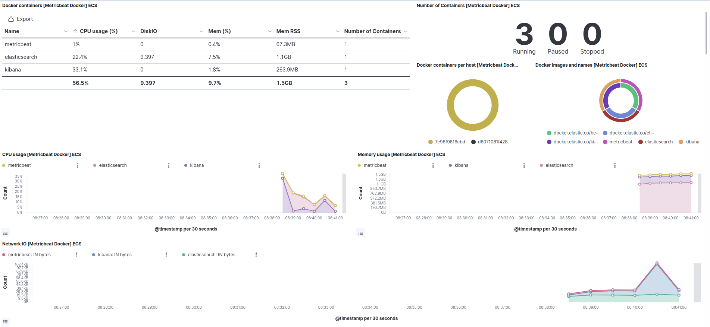
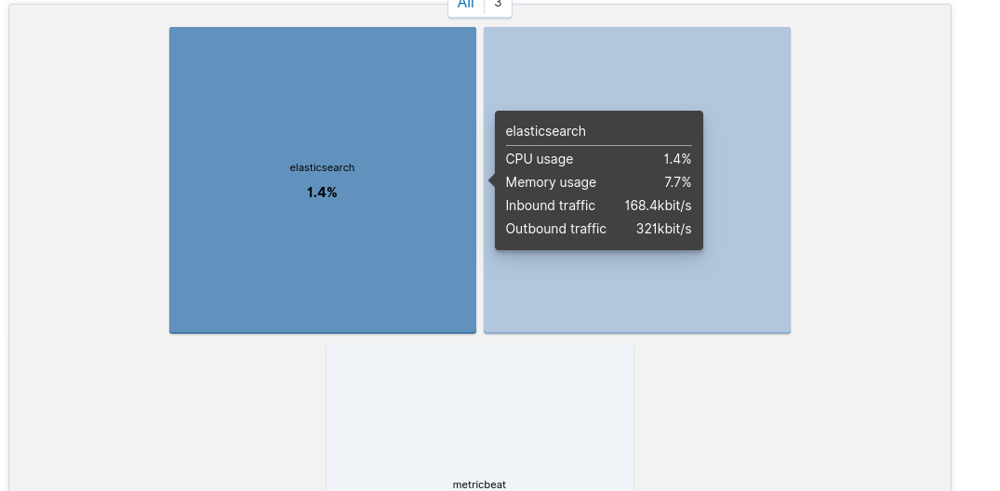

## Elastic Stack 
Example how to you can use elastic-stack. 
#

## How to run ?
    $ sudo chmod +777 /var/run/docker.sock
    $ docker-compose up --build -d

#
## URLS
- elasticsearch: http://localhost:9200
- kibana: http://localhost:5601

#
## Metric Beat

The metric beat configuration are in <b>./beats/metric/metricbeat.yml</b> with docker and elasticsearch modules, and output to elasticsearch  with automatic configuration dashboards

#
